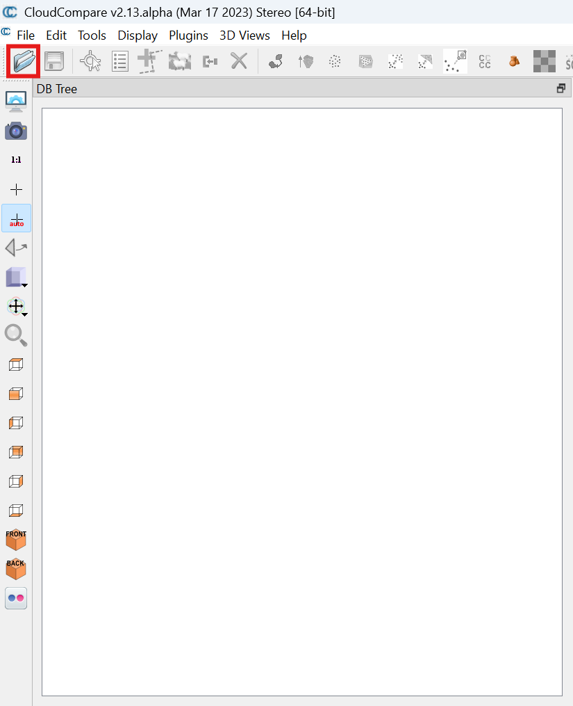
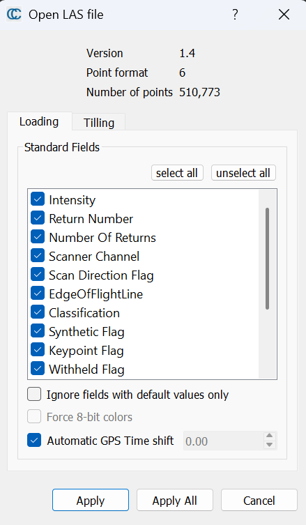
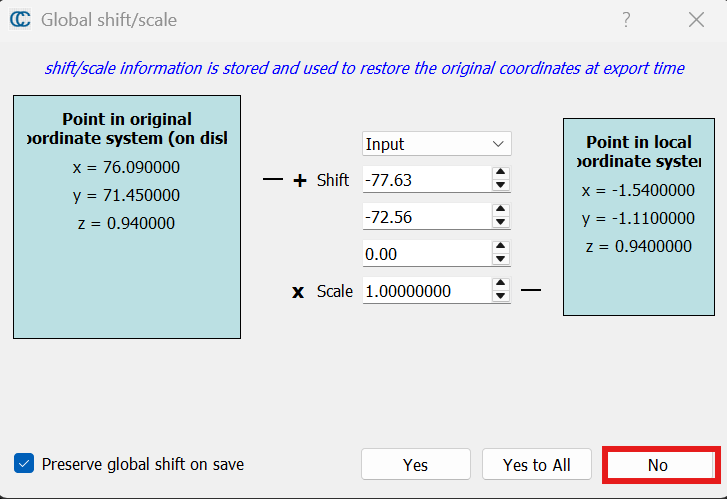
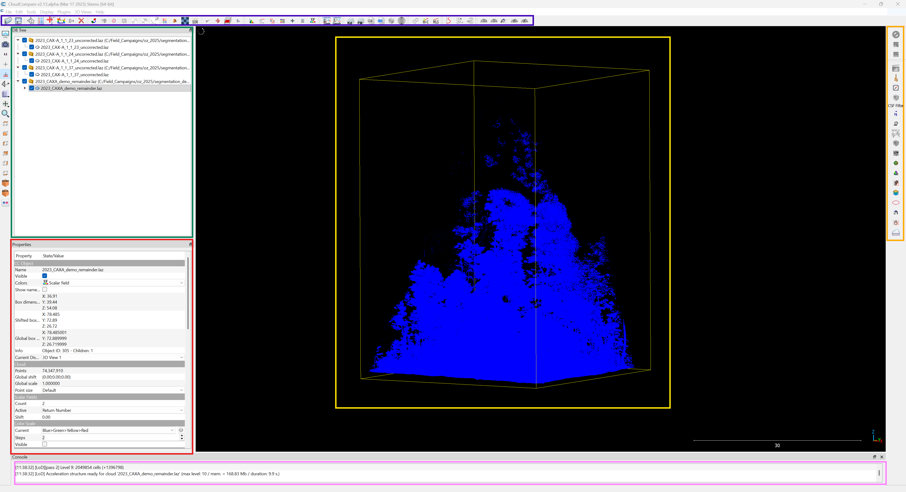
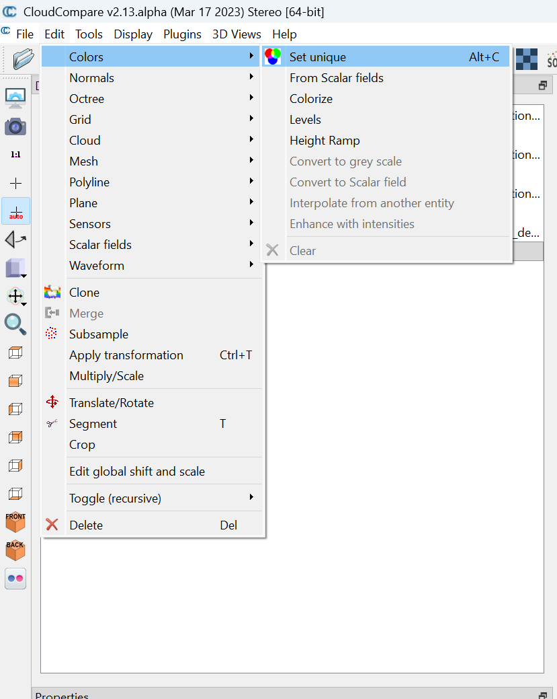
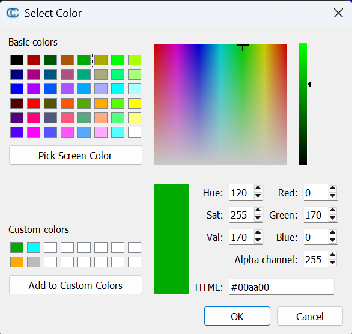
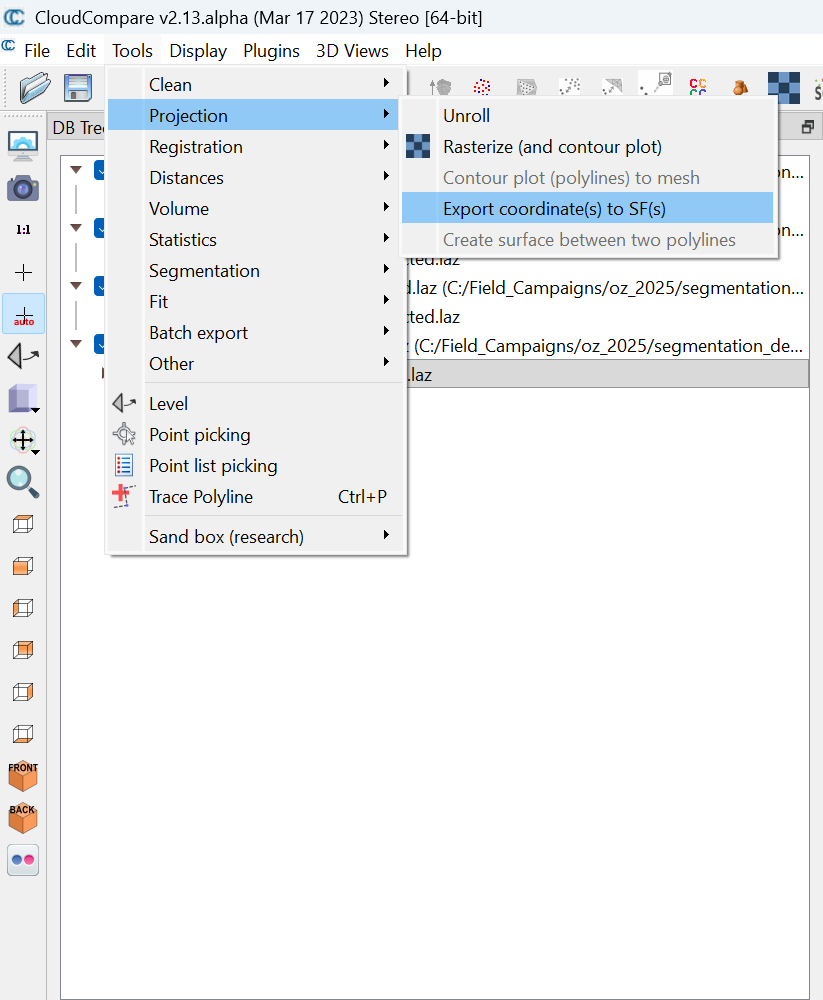
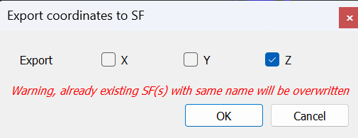
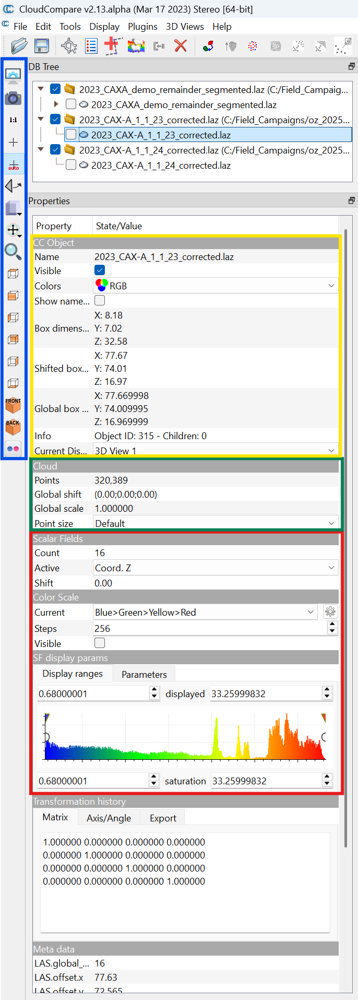

## 1. Opening files with CloudCompare

#### Option 1: Open CloudCompare and click the file icon in the top left of the window.  

  

#### Option 2: Open CloudCompare, drag and drop the file into the CloudCompare viewer window.

### 1.1 Open file settings
Depending on the file type, there are different options when opening a file. The options taken may vary depening on your project need, however in general it is usually best to **preserve as many fields as possible** and to select no when shifting/scaling the data.

1. Load in standard fields:

2. Reject shifting/scaling:

## 2. CloudCompare main overview
Now that we have some data loaded, lets take a step back and examine the different parts of the interface.

The blue box highlights the toolbar with many important functions such as save, load, segment, merge, etc.

The yellow box highlights the main viewing area. This is where we will manipulate and view our point clouds.

The green box highlights our loaded files in a tree. Try toggling on/off some of the loaded data to get a sense of how it works.

The red box highlights the properties for a selected point cloud. Note that this is point clouds specific. Also, using the mouse wheel while hovering over a drop down menu will change the options!

The pink box is the console. For now, it is only important to know that it will display some messages to help us stay informed.

## 3. Visualization basics
Before we manipulate data, we can make our lives easier by visualizing the data in our preferred manner. This is up to personal taste, so here we will supply an explanation of the basic options. For a more complex (and beautiful) visualization procedure, please read the color-tree-point-cloud-with-CloudCompare repository on the Q-ForestLab Github.

### 3.1 File unique colorization
When segmenting individual trees, it can be nice to assign each tree (and the remainder point cloud) specific colors. We can accomplish this in a few steps:
#### 1. Make sure to have the desired file selected
#### 2. Navigate to Edit > Colors > Set unique

#### 3. Select the desired color

If you find yourself returning to the same colors, you can click 'Add to Custom Colors' to make them easily accesible in the future.

### 3.2 Scalar field colorization (height gradient)
If you prefer to have some of your point clouds colored by height, this is a good option. You can also change the colors in the gradient.

#### 1. Navigate to Tools > Projection > Export coordinate(s) to SF(s)

#### 2. Export the desired coordinates to a scalar field
Assuming the point cloud is oriented with z pointing up, the z coordinate scalar field can be used for a height gradient.

### 3.3 Miscellaneous visualization options
Lets take a closer look at some useful parts of the properties window:

The yellow box contains the options for toggling point cloud visibility, as well an option to switch between RGB (file unique colorization) and scalar field colorization (height gradient). There is also a toggle to display the point cloud label in the viewing window.

The green box is a useful option to change point size. This is purely visual and does not modify the data. The points will display poorly on certain displays, and increasing the point size can help alleviate this.

The red box contains the options to modify the color scale used in the scalar field colorization.

The blue box contains some options that will alter the display window, such as automatic selection of a camera rotation point, or snapping the view to the x, y, or z plane.

### Lastly, if you are interested in creating a crown map to help keep track of your segmentation progress, as well as have a list of the nearest neighboring trees for corrections, check out get_crown_shape.Rmd found in the scripts secion in this repo.

### That covers the basics of opening and visualizing files needed for segmentation, now you are ready to start segmenting!