## 1. Final preparation
Before segmenting, be sure to have your files visualized clearly. If you are following along with the demo data, you can see an example below:

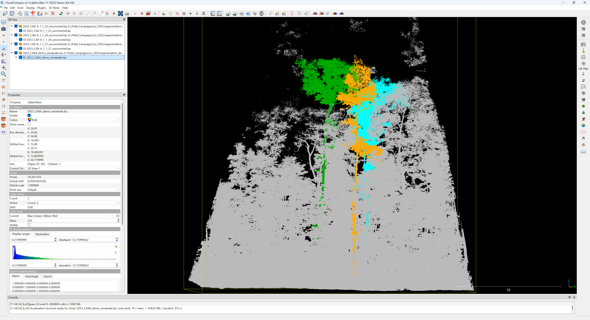

## 2. Start Segmentation

We will first focus on disentangling two of the demo trees. Tree 1_1_23 is in green and tree 1_1_24 is in aqua:

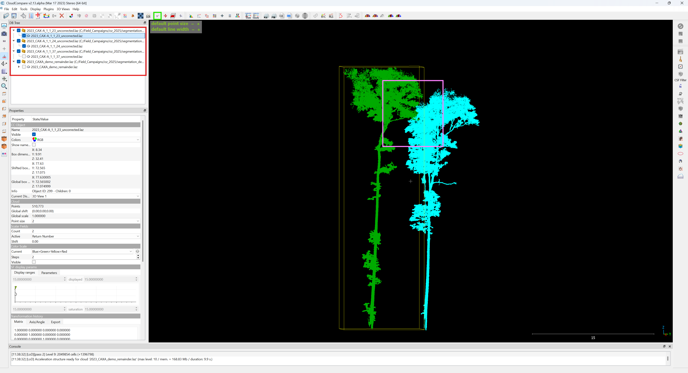

The overlapping part of the trees is highlighted in the above image in the pink box.

Before starting segmentation, ensure you have the correct file selected. Select the file for tree 1_1_23 (highlighted in the above image in the red box)

Finally, we can start segmenting by clicking on the scissors icon, highlighted in the green box, which will bring up the below toolbar:

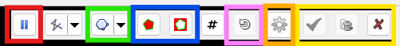

In the above image:
1. The red box highlights the pause button. This button toggles drawing a polygon to select points/moving the viewing window. The hotkey is spacebar, although it is prone to malfunction.
2. The green box will allow you to change between polygonal and rectangular selection.
3. The blue box highlights the segment in/segment out buttons. This will allow you to either hide points within a drawn polygon, or only display those points.
4. The pink box is an undo option.
5. The orange box opens a dialogue to change the automatic naming convention of segmented parts.
6. The yellow box highlights the buttons to finish segmentation. This can be either by confirming the segmentation or cancelling. **WARNING** closing the segmentation session will eliminate all segmentation work completed since the last segmentation confirmation. The only way to segment is to select 'confirm segmentation,' and until then all progress is temporary. CloudCompare can be prone to crashing, so it is recommended to do this regularly.

Note that while a segmentation session is active, the other tools in the top toolbar are disabled.

## 3. Polygon drawing and confirming segmentation

Now that we have segmentation started, we can zoom in to the overlapping area between the two demo trees and draw a polygon around the area we want to remove from tree 1_1_23. If you are unable to move the view window and are instead drawing a polygon, try pausing the segmentation as outlined in the previous step.

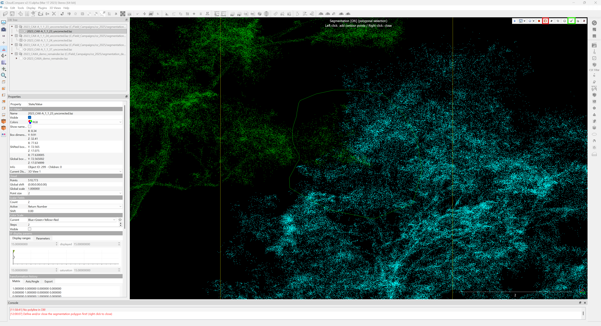

With a polygon drawn around the desired area, you can now click the 'segment out' button to hide those points. Note that those points are not deleted, only temporarily hidden until we confirm segmentation. If you are unable to segment out points from tree 1_1_23, make sure it was selected in the file selection window before starting the segmentation tool.

When you are happy with the segmented out points, continue by clicking on 'confirm segmentation,' highlighted in the above image in green. This will create a new segmented file in the file selection window (as seen in the figure below), and all the hidden points should reapper in the viewing window. To get a sense of how the new files are named, try turning selecting/unselecting them in the file selection window a few times. Congratulations, you've segmented a piece of a point cloud!

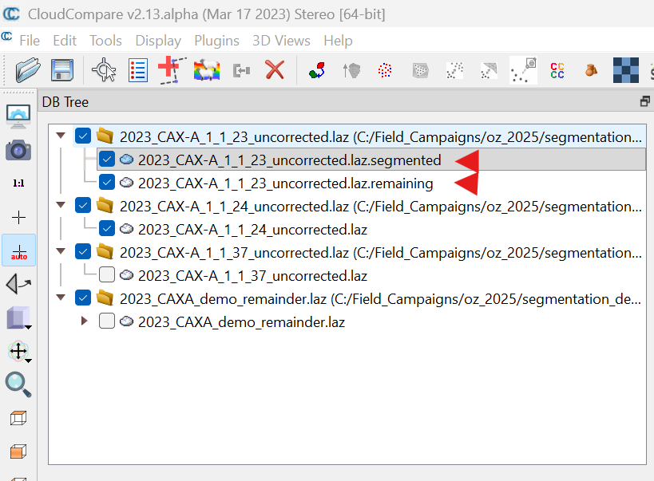

## 4. Merging files

We will now merge the segmented file from tree 1_1_23 into tree 1_1_24. Start by selecting both files in the file selection window (this can be done with ctrl + click).

**WARNING** The name of the newly created file after the merge will be based on the first file selected when selecting multiple files. File names can always be changed later, but creating continuity of file names can help in staying organized within a project.

With both files selected, click on the merge button (highlighted in the below image in red). You can choose to create scalar fields if desired; this creates a new data field that will keep track of what point cloud individual pieces of the newly created combined point cloud originate from. It is not required but can be interesting for keeping track of segmentation progress in the future.

After your merge is complete, you can visualize the changes. You may need to recolor the newly combined point cloud if you chose to create a new scalar field. For the demo data, we are now left with the below image:

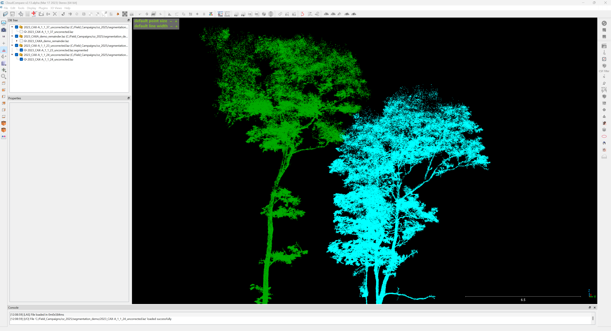

This covers the basic method of segmentation/merging that is required to reorganize point cloud data. 

## 5. Working with larger point clouds/plot remainders

CloudCompare can have performance and stability issues when manipulating large point clouds. In order to segment trees from plot level data, we will first isolate the immediate surrounds of our target tree.

First, toggle both tree 1_1_23 and the demo_remainder point cloud on in the visualization window. Next, click the top-down view button highlighted in red in the below image.

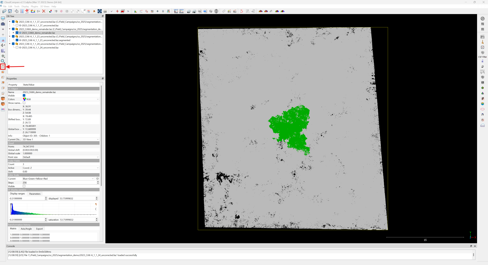

Now that we have a good perspective on our data, we can perform a segmentation on the remainder point cloud, leaving a small buffer in the area around our target tree. If you have the remainder point cloud selected, your segmentation will not apply to any other visible point clouds. Perform a segmentation to create something similar to the below image.

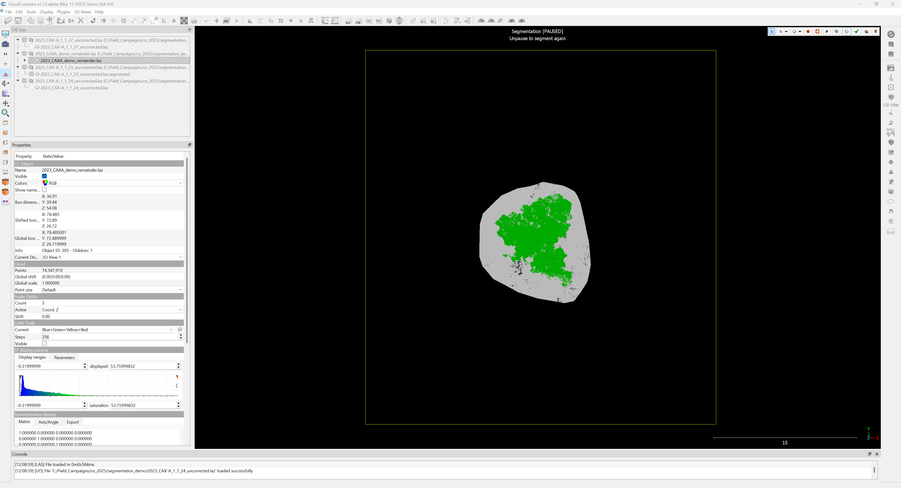

Once the segmentation is confirmed, toggle off the portions of the remainder point cloud that we segmented out in the previous step. You can now move your viewer to inspect the data from different perspectives and get a sense of what further segmentation is required to have a complete tree. In the below image, there are red boxes highlighting portions of point clouds that should be removed.

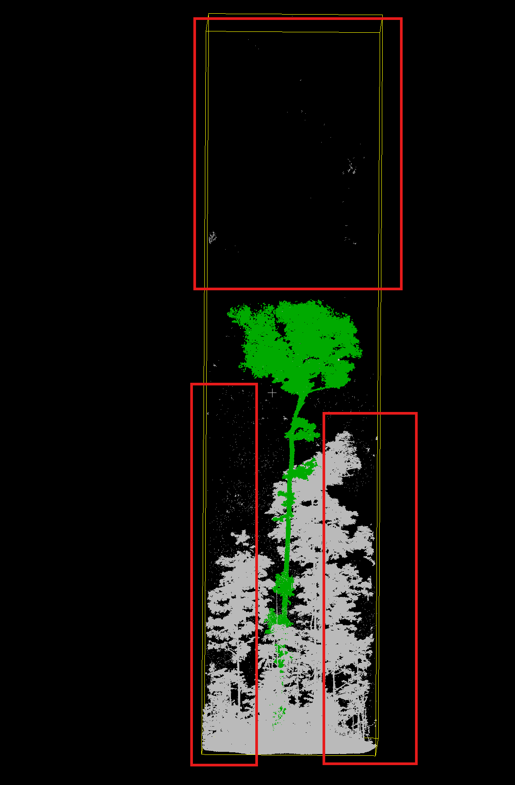

**Note:** for many tree structural modeling applications, a clean trunk base and stem are very important. It is worth taking time to 'clean' the stem now and avoid returning to fix errors in the future.

The below images show examples of completely segmented and remerged point clouds using the demo data. Note how there are large portions of points reorganized in the canopy, and many points removed that were surround the stem. To be clear: no points are ever deleted in this process, only moved between files. The completely segmented tree is also available in the demo_data folder.

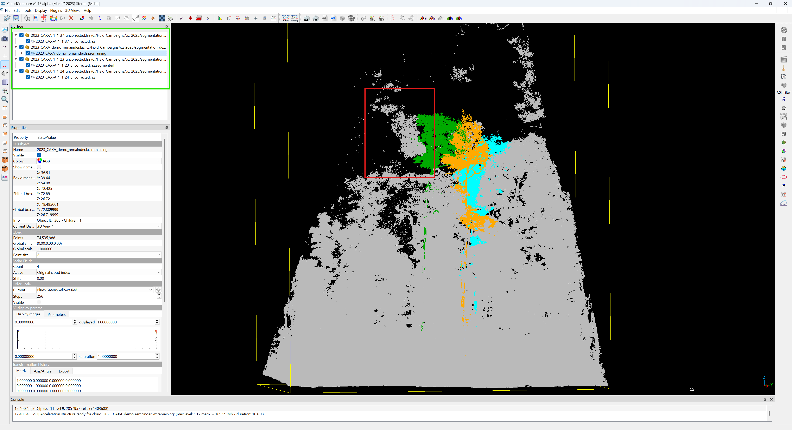
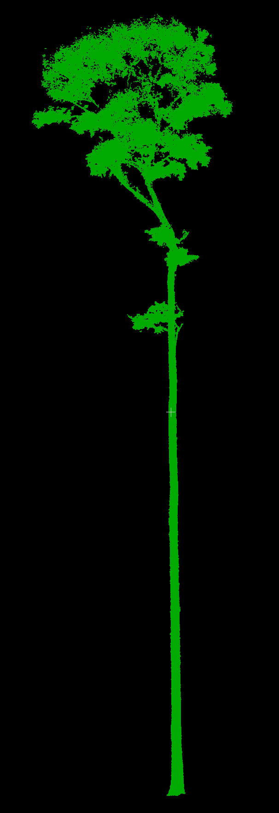

## 6. Saving data

None of this work is permanent until the files are resaved. 

Select the desired point cloud in the file selection window, then navigate to File > Save
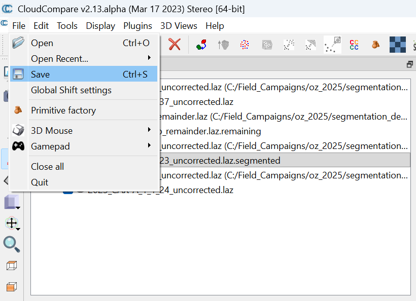

Find the desired folder to save your point cloud in. Pay careful attention to the naming/file type. If you make a mistake, later you can reopen your saved point cloud and save it as a different file type.

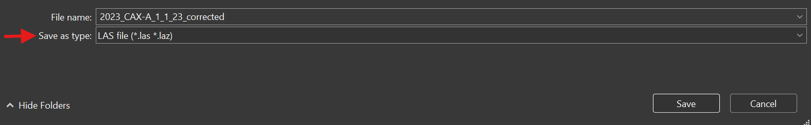

## Now that you have saved your freshly segmented tree, it's just a matter of repeating the process and staying organized. Good luck!